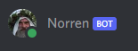

# discord-bot-norren



Discord bot for the Heroes of Mirren Discord server.

* [Setup bot](#setup-bot)
* [Invite to server](#invite-to-server)
* [Setup app](#setup-app)
* [Scripts](#scripts)
* [Adding new commands](#adding-new-commands)


## Setup bot

Create an application and bot in the Discord portal, as per guides.

Ensure the bot has the "Message Content" Privileged Gateway Intents.


## Invite to server

Create an URL using the Discord portal, such as:

```
https://discord.com/api/oauth2/authorize?client_id=$CLIENT_ID&permissions=3148800&scope=bot%20applications.commands
```

Ensure the URL has the following scopes:

* `bot`
* `application.commands`

And the following permissions:

* `Read Messages/View Channels` general permissions.
* `Send Messages` text permissions.
* `Connect` and `Speak` voice permissions.


## Setup app

0. Add git safe directory:

```
git config --global --add safe.directory /home/pi/code/discord-bot-norren
```

1. Install dependencies:

```
sudo apt-get install libtool autoconf automake ffmpeg
```

```
npm ci
```

> Installing `sodium` may take several minutes.

2. Add `config.json` with credentials and other options. For example:

```json
{
  "token": "<app token>",
  "clientId": "<application id>",
  "guildId": "<server id>",
  "reactions": [
    { "trigger": "hello", "emoji": "👋" }
  ],
  "onJoinSound": "<sound>.opus",
  "onLeaveSound": "<sound>.opus",
  "elevenlabsApiKey": "<API key>",
  "elevenlabsVoiceId": "<voice ID>",
  "openAiApiKey": "<OpenAI API key>",
  "adminUsernames": ["<Discord username>"]
}
```

3. Pre-load the `sounds` and `music` directories with files to be matched by the `query`.

> Audio files must be in the Opus sound format.

> Sets of files to be used randomly must have an underscore, e.g: `guard_5.opus`.

Optionally use `scripts/sync-s3.sh` to sync `sounds` and `music` from an S3
bucket location containing a `sounds` and `music` directory:

```
# Uses a local AWS CLI install and credentials
export AWS_PROFILE=...

./scripts/sync-s3.sh s3://my-example-bucket/discord-bot-norren
```

> No trailing slash on path to the bucket directory.

4. Start the app:

```
npm start
```


## Options

Update slash commands in all known guilds upon startup:

```
npm start -- --updateCommands
```


## Scripts

Make the bot say something:

```
node scripts/say.js $CHANNEL_ID $MESSAGE
```

Make the bot react to a message:

```
node scripts/react.js $CHANNEL_ID $MESSAGE_ID $EMOJI
```


## Adding new commands

1. Add to `src/modules/commands.js`
2. Add to map in `src/modules/handlers.js`
3. Add to help text in `src/commands/help.js`
